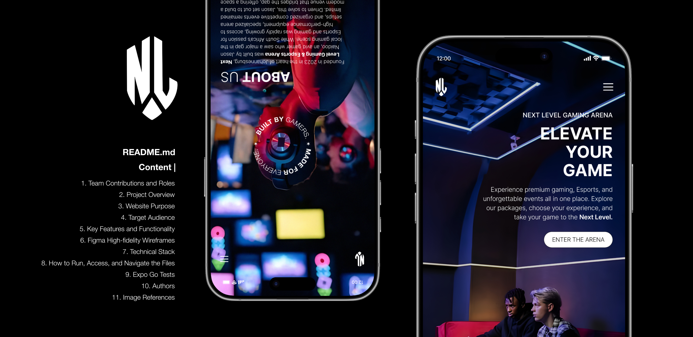
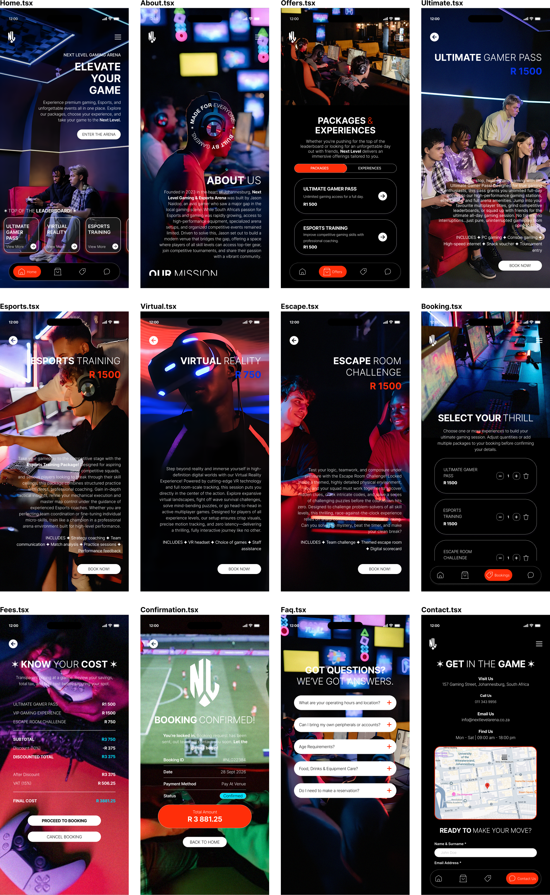

# Welcome to the **NEXT LEVEL GAMING ARENA** App

[✦ YOUTUBE VIDEO LINK ✦](https://youtu.be/Z1DuGEvNvk8?si=75ISm0o_flsh9m6-)

REMEMBER TO INCREASE THE VIDEO QUALITY ON YOUTUBE TO 1080DP

## 1. Team Contributions & Roles

| Team Member           | Branch Name        | Primary Contributions & Responsibilities                                                                                                              |
| :-------------------- | :----------------- | :---------------------------------------------------------------------------------------------------------------------------------------------------- |
| **Lethabo Mohlala**   | `lethabos-screens` | Developed `Home.tsx`, `About.tsx`, navigation setup, overall project UI architecture, and Expo mobile testing configurations.                         |
| **Keabetswe Mathole** | `kea-screens`      | Implemented `Offers.tsx` catalogue, package detail screens (`Ultimate.tsx`, `Esports.tsx`, `Virtual.tsx`, `Escape.tsx`).                              |
| **Kevin Siaga**       | `kevins-screens`   | Designed `Booking.tsx` selection engine, `Fees.tsx` price and VAT calculation logic, `Confirmation.tsx`, and `Contact.tsx` embedded maps integration. |

## 2. Project Overview

### Mission

We are dedicated to driving the expansion of South Africa’s Esports and gaming ecosystem. By combining modern hardware, inclusive community spaces, and competitive events, Next Level provides an accessible platform where casual players can socialise and aspiring pro-gamers can hone their skills.

### Vision

To become South Africa's premier gaming center and community hub, setting the standard for local esports events, high-performance gaming experiences, and interactive community engagement.

## 3. App Purpose

The Next Level Gaming Arena mobile application connects gamers directly with our physical venue in Johannesburg and online booking services. The application allows users to explore available packages and experiences (Ultimate Gamer Pass, Esports Training, Virtual Reality, Escape Room Challenge), select custom quantities, calculate discounted totals with transparent fee summaries, confirm bookings, review FAQs, and contact venue management directly.

## 4. Target Audience

**Casual Gamers ✶** Individuals looking for high-end setups, console lounges, and VR experiences to play with friends.

**Competitive Esports Players & Teams ✶** Gamers seeking high-refresh-rate rigs, structured training sessions, and professional coaching.

**Event Organizers & Party Hosts ✶** Users looking to book group packages, escape room challenges, or private venue experiences.

**Gaming Communities ✶** Streamers and local gaming enthusiasts looking for high-speed internet and dedicated gaming stations.

## 5. Key Features and Functionality

### Home Page (`Home.tsx`)

- Dynamic landing banner ("Elevate Your Game") with an interactive "Enter the Arena" button.
- "Top of the Leaderboard" carousel featuring quick access to packages like Ultimate Gamer Pass, Virtual Reality, and Esports Training.
- Bottom navigation bar for rapid switching between main screens.

### About Us (`About.tsx`)

**Our Story ✶** Founded in 2023 in Johannesburg by Jason Naidoo to bridge the gap in South Africa's high-performance Esports scene.

**Our Mission ✶** Detailed commitment to accessible, high-end gaming and community growth.

### Offers

**Offers Hub (`Offers.tsx`):** Toggle view between **Packages** and **Experiences**.

**Ultimate Gamer Pass (`Ultimate.tsx` - R1,500):** Unlimited full-day gaming access across high-performance stations. Includes PC gaming, Console gaming, High-speed internet, Snack voucher, and Tournament entry.

**Esports Training (`Esports.tsx` - R1,500):** Dedicated structured practice, strategy coaching, team communication, and performance feedback.

**Virtual Reality (`Virtual.tsx` - R750):** Full-room scale VR tracking, wireless headsets, and zero-latency immersive gameplay[cite: 1].

**Escape Room Challenge (`Escape.tsx` - R1,500):** High-intensity physical puzzle room featuring team challenges, digital scorecards, and themed rooms.

### Bookings & Calculation (`Booking.tsx` & `Fees.tsx`)

**Select Your Thrill (`Booking.tsx`):** Add multiple packages to your cart and adjust item quantities with intuitive increment/decrement buttons.

**Know Your Cost (`Fees.tsx`):** Itemized price breakdown showing subtotal, percentage discounts, calculated VAT (15%), and total final cost prior to checkout.

**Booking Confirmation (`Confirmation.tsx`):** Displays unique Booking ID, reservation date, payment method, status badge, total amount paid, and quick navigation back home.

### FAQs & Support (`Faq.tsx`)

- Expandable accordion answers covering operating hours, location, personal peripherals, age requirements, food/drink policies, and reservation guidelines.

### Contact Us

- Physical venue address (157 Gaming Street, Johannesburg, South Africa), phone number, email address, and operating hours (Mon - Sat: 09:00 am - 18:00 pm).
- Embedded interactive map showing proximity to landmark locations like the University of the Witwatersrand.
- Direct inquiry form for name and email submission.

## 6. Figma High-fidelity Wireframes

## 7. Technical Stack

### Core Technologies

**React Native / TypeScript (`.tsx`):** Component-driven mobile app architecture with static typing for UI screen
(`Home.tsx`, `About.tsx`, `Offers.tsx`, `Booking.tsx`, `Fees.tsx`, etc.).

**Expo Framework:** Cross-platform development toolchain and mobile runtime container.

**React Navigation:** Tab-based and stack-based navigation across all screens.

### External Asset

**Embedded Maps:** Embedded location map on `Contact.tsx` pinpointing venue coordinates in Johannesburg.

**Custom Media Assets:** Local graphics, banner overlays, and action UI icons stored under `./images/`.

### Developer Tools & Version Control

- **Git |** Distributed version control system for tracking incremental changes and page updates.
- **GitHub |** Cloud-based repository hosting and changelog tracking via Conventional Commits.
- **Visual Studio Code |** Primary IDE.

## 8. How to Run, Access, and Navigate the Files

### Running the Website Locally

**1. Clone the Repository:**

- git clone [https://github.com/Lethabomohlala/Next-Level-Gaming-Arena.git](https://github.com/Lethabomohlala/Next-Level-Gaming-Arena.git)

**2. Open the Project Directory:**

- cd Next-Level-Gaming-Arena

**3. Install Dependencies:**

- npm install

**4. Start the Project:**

- npx expo start

**5. Branches:**

- main (default)- lethabos-screens
- kea-screens
- kevins-screens

**6. Code Base Architecture & Navigation:**

Root .tsx Screen Files:

- Home.tsx ✶ Main landing screen & featured carousel
- About.tsx ✶ Founder history and mission details
- Offers.tsx ✶ Package and experience catalogue toggle
- Ultimate.tsx, Esports.tsx, Virtual.tsx, Escape.tsx ✶ Detailed offer breakdown screens
- Booking.tsx ✶ Interactive quantity selector for packages
- Fees.tsx ✶ Price summary, discounts, and VAT calculation
- Confirmation.tsx ✶ Digital receipt and booking status
- Faq.tsx ✶ Expandable FAQ accordion
- Contact.tsx ✶ Address, hours, interactive map, and contact form

**7. Documentation:**

- README.md ✶ Complete project guide and documentation.

**8. Making Changes and Pushing Updates:**

To update code or content via VS Code Terminal:

- Edit target files: Save changes in your .tsx files.
- Stage changes | git add .- Commit with detailed message | git commit -m “short description" -m "- Detailed line 1
  Detailed line 2.”
- Push to remote repository | git push origin main

## 9. Running tests on Expo Go

These are screenshots of the app emulator running in expo go:

## 10. Authors

- **Lethabo Mohlala**
- **Keabestswe Mathole**
- **Kevin Siaga**

### Copyright

© 2026 Group 6. All rights reserved.

This project and its source code are intended for educational and project purposes. Unauthorized copying, redistribution, or commercial use of this project is not permitted without permission from Lethabo Mohlala, Keabestswe Mathole and Kevin Siaga.

## 11. Image References

Darmel, A. _[s.a.]_. _A boy and girl playing games._ [Online image]. Pexels. Available at: https://www.pexels.com/photo/a-boy-and-girl-playing-games-7862384/ [Accessed: 06 October 2026].

Darmel, A. _[s.a.]_. _A person holding a wireless game controller._ [Online image]. Pexels. Available at: https://www.pexels.com/photo/a-person-holding-a-wireless-game-controller-7862390/ [Accessed: 06 October 2026].

Darmel, A. _[s.a.]_. _Group of friends playing a video game._ [Online image]. Pexels. Available at: https://www.pexels.com/photo/group-of-friends-playing-a-video-game-7862405/ [Accessed: 06 October 2026].

Darmel, A. _[s.a.]_. _Men sitting on the couch while playing video games._ [Online image]. Pexels. Available at: https://www.pexels.com/photo/men-sitting-on-the-couch-while-playing-video-games-7862272/ [Accessed: 06 October 2026].

Krukau, Y. _[s.a.]_. _A team playing online games._ [Online image]. Pexels. Available at: https://www.pexels.com/photo/a-team-playing-online-games-9072248/ [Accessed: 06 October 2026].

Krukau, Y. _[s.a.]_. _Men in a computer shop._ [Online image]. Pexels. Available at: https://www.pexels.com/photo/men-in-a-computer-shop-9072326/ [Accessed: 06 October 2026].

Krukau, Y. _[s.a.]_. _Men playing computer games._ [Online image]. Pexels. Available at: https://www.pexels.com/photo/men-playing-computer-games-9072319/ [Accessed: 06 October 2026].

Krukau, Y. _[s.a.]_. _Men pointing on computer screen._ [Online image]. Pexels. Available at: https://www.pexels.com/photo/men-pointing-on-computer-screen-9072251/ [Accessed: 06 October 2026].

Krukau, Y. _[s.a.]_. _People using computers._ [Online image]. Pexels. Available at: https://www.pexels.com/photo/people-using-computers-9072392/ [Accessed: 06 October 2026].

Krukau, Y. _[s.a.]_. _Young men engaged in e-sports playing in a tournament._ [Online image]. Pexels. Available at: https://www.pexels.com/photo/young-men-engaged-in-e-sports-playing-in-a-tournament-9072328/ [Accessed: 06 October 2026].

SHVETS Production _[s.a.]_. _Portrait of a man using a virtual reality headset._ [Online image]. Pexels. Available at: https://www.pexels.com/photo/portrait-of-a-man-using-a-virtual-reality-headset-7562029/ [Accessed: 06 October 2026].
